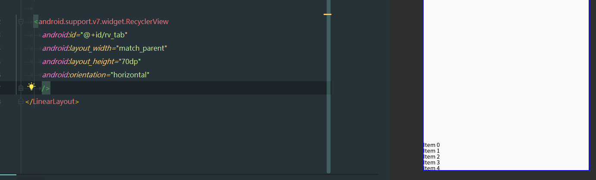
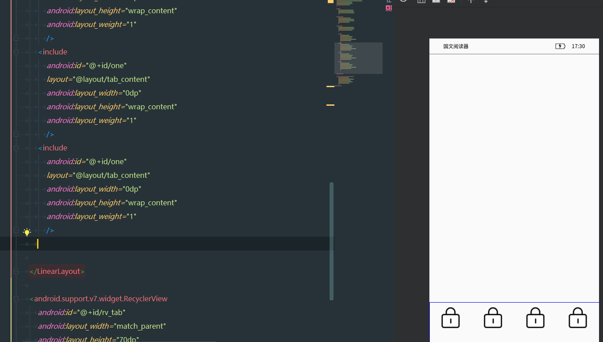
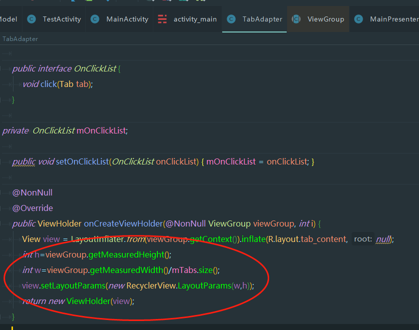

目标：想让recyclerView横向排列占满屏幕，item则水平均匀分布。 
过程：放弃recyclerView，放弃adapter的便利，改用LinearLayout以用weight属性实现均匀分布。 
结果：在adapter里利用LayoutParams改变item的宽度实现了水平均匀分布。 
感悟：如果熟悉LayoutParams，清楚item等等的显示过程，也就不会去想半天LinearLayout了。深入了解整个过程虽然费时间，然而必不可少。  
  
  

