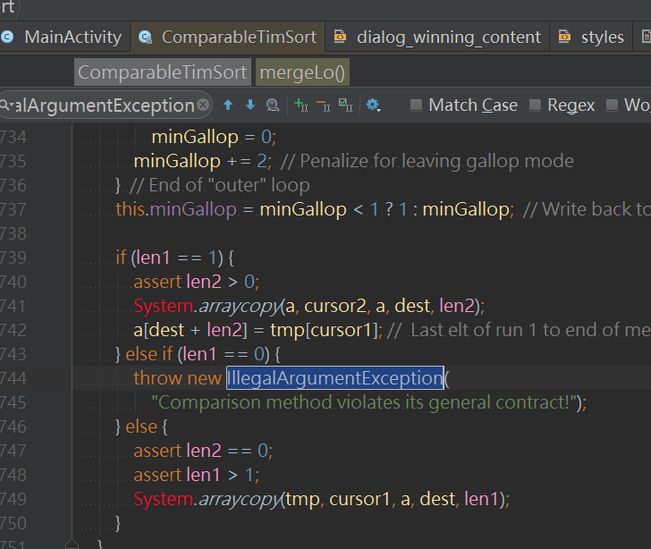
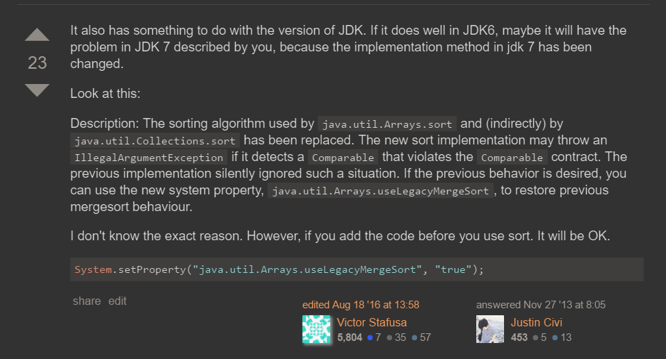

问题
===
```java
throw new IllegalArgumentException(
    "Comparison method violates its general contract!");

java.lang.IllegalArgumentException: 
  at java.util.ComparableTimSort.mergeLo(ComparableTimSort.java:710)
  at java.util.ComparableTimSort.mergeAt(ComparableTimSort.java:447)
  at java.util.ComparableTimSort.mergeForceCollapse(ComparableTimSort.java:388)
  at java.util.ComparableTimSort.sort(ComparableTimSort.java:187)
  at java.util.ComparableTimSort.sort(ComparableTimSort.java:142)
  at java.util.Arrays.sort(Arrays.java:1957)
  at java.util.Collections.sort(Collections.java:1864)
  at android.view.ViewGroup$ChildListForAccessibility.init(ViewGroup.java:6882)
  at android.view.ViewGroup$ChildListForAccessibility.obtain(ViewGroup.java:6847)
  at android.view.ViewGroup.dispatchPopulateAccessibilityEventInternal(ViewGroup.java:2610)
  at android.view.View.dispatchPopulateAccessibilityEvent(View.java:5026)
  at android.view.View.sendAccessibilityEventUncheckedInternal(View.java:4991)
  at android.view.View.sendAccessibilityEventUnchecked(View.java:4975)
  at android.view.View.sendAccessibilityEventInternal(View.java:4952)
  at android.view.View.sendAccessibilityEvent(View.java:4921)
  at android.view.View.performClick(View.java:4458)
  at android.view.View$PerformClick.run(View.java:18770)
  at android.os.Handler.handleCallback(Handler.java:808)
  at android.os.Handler.dispatchMessage(Handler.java:103)
  at android.os.Looper.loop(Looper.java:193)
  at android.app.ActivityThread.main(ActivityThread.java:5292)
  at java.lang.reflect.Method.invokeNative(Native Method:0)
  at java.lang.reflect.Method.invoke(Method.java:515)
  at com.android.internal.os.ZygoteInit$MethodAndArgsCaller.run(ZygoteInit.java:824)
  at com.android.internal.os.ZygoteInit.main(ZygoteInit.java:640)
  at dalvik.system.NativeStart.main(Native Method:0)
  ```



  不解决了，爱咋咋滴
  ===
  [so答案1](http://stackoverflow.com/questions/11441666/java-error-comparison-method-violates-its-general-contract)
   

  * [so答案](http://stackoverflow.com/questions/13575224/comparison-method-violates-its-general-contract-timsort-and-gridlayout)
  * [so答案](http://stackoverflow.com/questions/271506/why-cant-system-setproperty-change-the-classpath-at-runtime?rq=1)
  * [so答案](http://stackoverflow.com/questions/21204334/system-setproperty-and-system-getproperty)
  * [so答案](http://stackoverflow.com/questions/11441666/java-error-comparison-method-violates-its-general-contract)
  * [so答案](http://stackoverflow.com/questions/7849539/comparison-method-violates-its-general-contract-java-7-only)
  * [so答案](http://stackoverflow.com/questions/6626437/why-does-my-compare-method-throw-exception-comparison-method-violates-its-gen)
