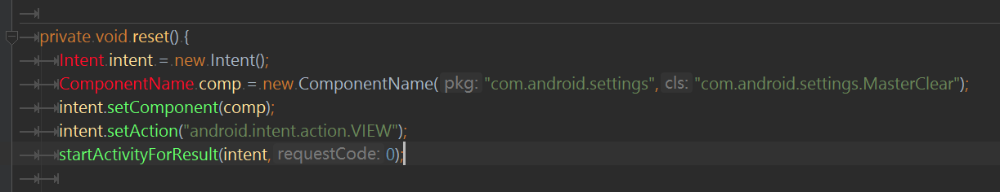

```java
E/AndroidRuntime: FATAL EXCEPTION: main
    android.content.ActivityNotFoundException: Unable to find explicit activity class {com.android.settings/com.android.settings.MasterClear}; have you declared this activity in your AndroidManifest.xml?
        at android.app.Instrumentation.checkStartActivityResult(Instrumentation.java:1777)
        at android.app.Instrumentation.execStartActivity(Instrumentation.java:1501)
        at android.app.Activity.startActivityForResult(Activity.java:3745)
        at android.support.v4.app.BaseFragmentActivityApi16.startActivityForResult(BaseFragmentActivityApi16.java:54)
        at android.support.v4.app.FragmentActivity.startActivityForResult(FragmentActivity.java:67)
        at android.app.Activity.startActivityForResult(Activity.java:3706)
        at android.support.v4.app.FragmentActivity.startActivityForResult(FragmentActivity.java:720)
        at
```        