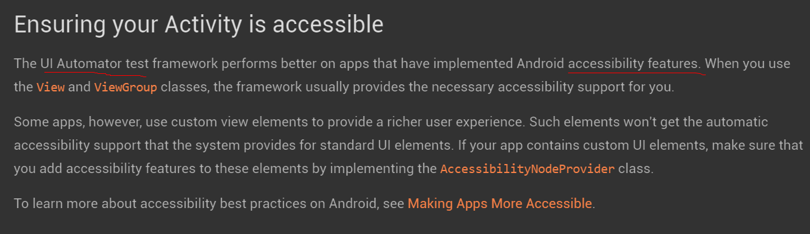

http://stackoverflow.com/questions/13575224/comparison-method-violates-its-general-contract-timsort-and-gridlayout

ZygoteInit

Method

Native Method

ActivityThread

Looper

Handler

AccessibilityInteractionController

View

FrameLayout

ViewGroup

Collections

Arrays

ComparableTimSort

