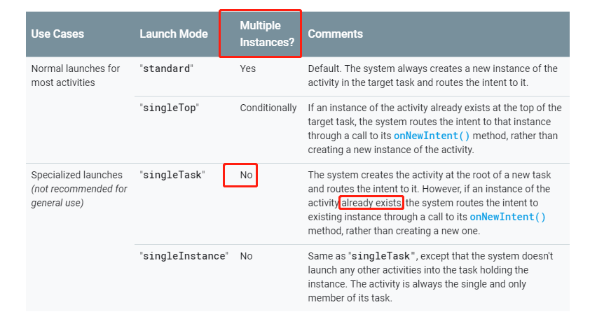

工具
===
adb shell dumpsys activity activities

过程
===
<br>1.在应用的清单文件里，设置一个Activity的启动模式为singleTask,并且不设置taskAffinity属性.
<br>2.在代码里，用添加Intent.FLAG_ACTIVITY_NEW_TASK、Intent.FLAG_ACTIVITY_MULTIPLE_TASK的方法实现多个task
<br>3.最后用adb工具查看有多少个task和activity的实例。

简明结果
===
```java
Running activities (most recent first):
      //任务栈3
      TaskRecord{e31f870 #240 A=com.example.myapplication U=0 StackId=1 sz=2}
        Run #4: ActivityRecord{93e01f u0 com.example.myapplication/.SingleTaskActivity t240}
        Run #3: ActivityRecord{f35c10d u0 com.example.myapplication/.StandardActivity t240}
      //任务栈2  
      TaskRecord{17b0f0f #239 A=com.example.myapplication U=0 StackId=1 sz=2}
        Run #2: ActivityRecord{d87afe5 u0 com.example.myapplication/.SingleTaskActivity t239}
        Run #1: ActivityRecord{f06c767 u0 com.example.myapplication/.StandardActivity t239}
      //任务栈1
      TaskRecord{4962b9c #238 A=com.example.myapplication U=0 StackId=1 sz=1}
        Run #0: ActivityRecord{b5fb852 u0 com.example.myapplication/.MainActivity t238}
```
通过看任务栈2和3，可以知道应用里面包含了设置为singleTask模式的Activity的多个实例。

结论
===

官网所述并未完整，activity要设置taskAffinity属性才能符合所述。

0.一个Activity,虽然启动模式为singleTask，但如果不设置taskAffinity属性，还是可能会出现本Activity的多个实例，这种可能性就是，有其它方式可以创建多个task，每个task都可以包含一个本Activity的实例。<br>
1.所以为了保证设置了singleTask模式的Activity在整个应用进程里只有一个实例，得设置taskAffinity属性才行

todo：添加示例应用