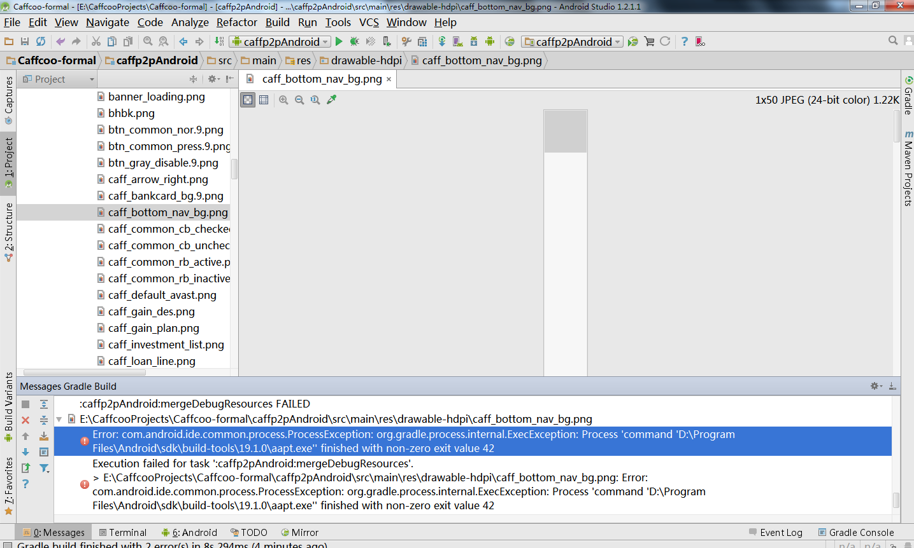

Q:
===

A:
===
删除了几个提示错误的用不到的图片文件和一个xml文件，又遇到了这个错误
Error:Execution failed for task ':caffp2pAndroid:preDexDebug'.
> com.android.ide.common.process.ProcessException: org.gradle.process.internal.ExecException: Process 'command 'D:\Program Files\Java\jdk1.7.0_79\bin\java

我就再build了一个项目再退出AS并在任务管理器关闭了java.exe，然后重启就可以了，妈个蛋