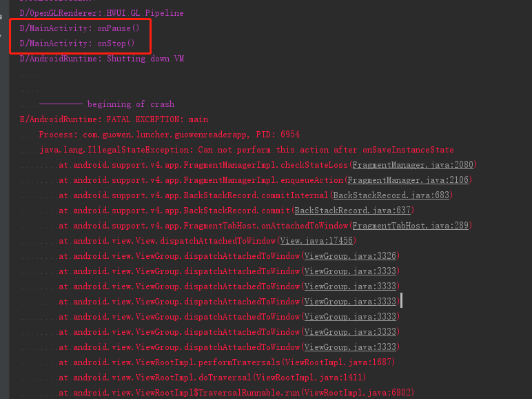

fixed： 根据 https://medium.com/@elye.project/handling-illegalstateexception-can-not-perform-this-action-after-onsaveinstancestate-d4ee8b630066 所述，是在放置新的Fragment的时候，旧的Fragment应该保存的状态没有保存好，没有做到应该做的所以才会Crash。这个已经算是结果了，我们应该去寻找导致状态没有保存好的原因，或者为什么会有新的Fragment需要进入而导致需要保存状态。

如这里，为何刚刚从AS编译出来运行的首页Activity，还没有进行任何操作就直接stop了，stop之后就导致Crash。

 解决：终于发现，系统会5秒之后就自动浅休眠，而休眠的时候，AS进行了编译运行，旧的进程就直接被干掉，但是新的进程在运行之后，MainActivity在stop了之后，依旧还有新的Fragment添加进来，但是我草你大爷的为何五秒就休眠搞出这么一堆屎谁爱收拾谁收拾。。。